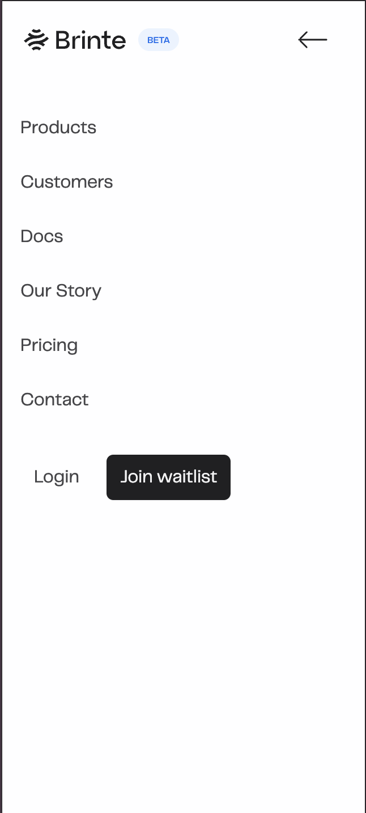
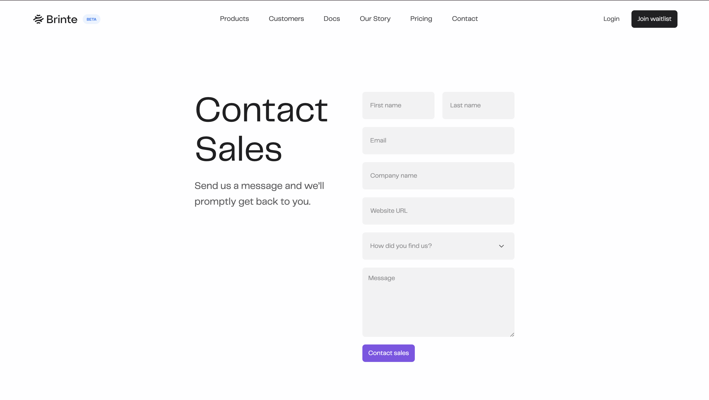
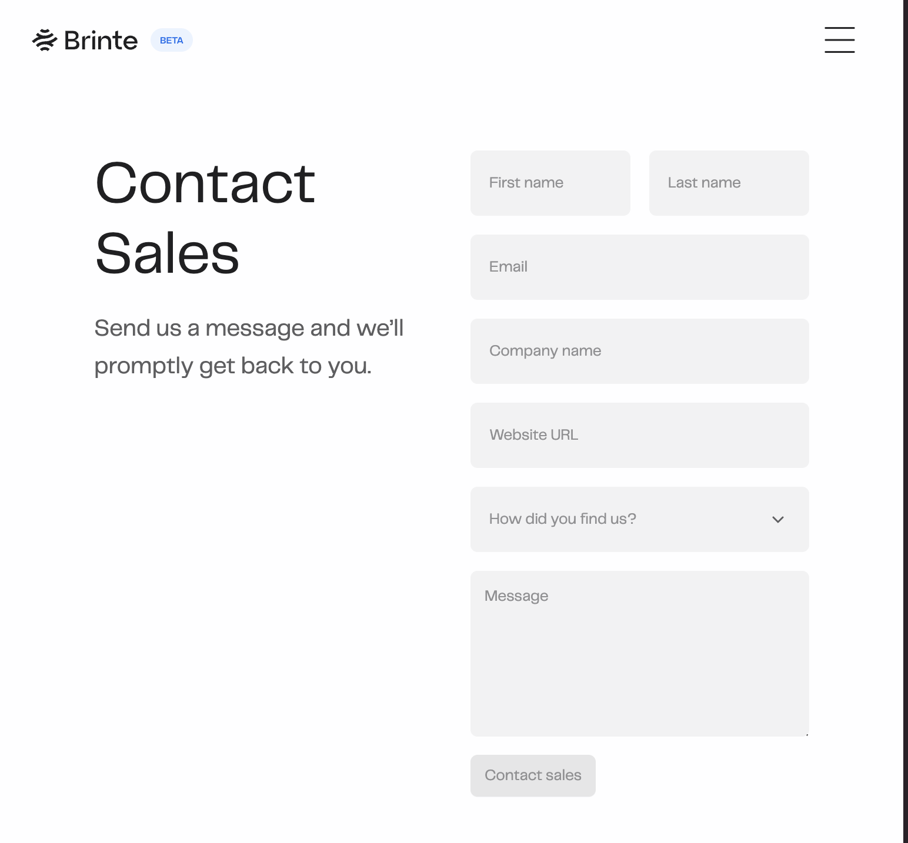
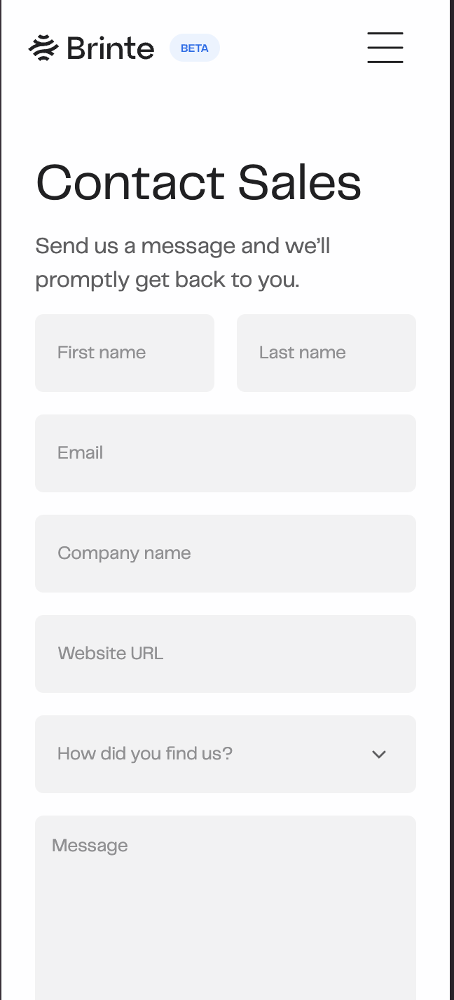

# Okra-Frontend-Engineer-Take-Home-Assessment
Table of Contents
- About the Project
- Tasks
- Technologies Used
- Installation
- Features/Component Breakdown
- Screenshots
- Project Link

# About the Project
This is a Takehome assessment for Frontend Engineer role at Okra.ng.
# Tasks
1. **Objective**: Create a single web page based on the [provided design assets](https://www.figma.com/design/266gI2IHh8ZH00TgEdUnk8/Design-Test?node-id=1-4&t=ifWinaObqbwEAsPr-0).
2. **Instructions**:
    - The design assets are on a different page (link or details will be provided).
    - While React is suggested, you can use any framework or library based on React.

# Technologies Used
- React
- Javascript
- Framer motion
- TailwindCss
- CSS
# Installation
- Clone the repository
git clone https://github.com/cddunni/Okra-Frontend-Engineer-Take-Home-Assessment.git

- Navigate to the project directory
cd repository

- Install dependencies
npm install

- Start the development server
npm run dev

# Features/Components Breakdown
- Button (enabled, hovered, pressed, loading, focused and disabled state)
- Input (enabled, hovered, pressed, focused, filled, error and disabled state)
- Dropdown (enabled, hovered, pressed, selected, focused, filled, error and disabled state)
- Textarea (enabled, hovered, pressed, focused, filled, error and disabled state)
- Card component (hovered, interactions)
- Navbar (interactions)

# Screenshots
- Mobile Menu View

- Desktop View

- Ipad View

- Mobile view

# Project Link
[okra-takehome-oluwatimileyin-akinpelu](https://okra-takehome-oluwatimileyin-akinpelu.netlify.app/)
